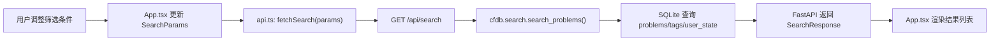
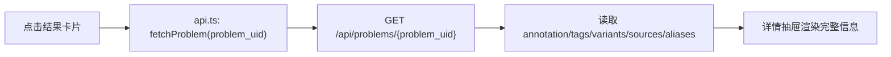
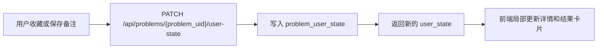

# WebUI 架构说明

本文件说明当前 WebUI 是怎么搭建的、为什么这样搭、各文件负责什么，以及后续扩展时应该改哪里。

## 总体选型

当前 WebUI 是一个轻量本地单页应用：

```text
React + TypeScript + Vite
FastAPI + SQLite
```

选择这个组合的原因：

- 本项目是本地个人查询工具，不需要复杂登录、权限或部署体系。
- React 足够适合做筛选面板、tag tree、结果列表、详情抽屉这类交互界面。
- TypeScript 能把后端返回的数据结构约束在 `types.ts` 里，减少字段名写错。
- Vite 启动快，适合本地迭代 UI。
- FastAPI 已经在 Python 项目里，能直接复用 SQLite 查询逻辑。
- 构建后的静态前端可以由同一个 FastAPI 服务托管，运行时只需要一个后端端口。

没有引入路由、Redux、组件库或 CSS 框架。现在的界面规模还不大，单文件 App + 少量工具模块更容易维护。

## 运行方式

开发模式有两个服务：

```text
Vite dev server: http://127.0.0.1:5173
FastAPI backend:  http://127.0.0.1:8765
```

`web/vite.config.ts` 配置了代理：

```ts
proxy: {
  "/api": "http://127.0.0.1:8765"
}
```

因此前端代码里只需要请求 `/api/...`，开发时 Vite 会自动转发到 FastAPI。

构建后：

```powershell
npm.cmd run build --prefix web
python -m uvicorn cfdb.web_app:app --reload --host 127.0.0.1 --port 8765
```

FastAPI 会检测 `web/dist`，并挂载：

- `/assets`：静态资源。
- `/{path:path}`：SPA fallback，返回 `index.html`。

这样生产/本地构建模式下只需要打开 `http://127.0.0.1:8765`。

## 后端职责

后端入口：

```text
cfdb/web_app.py
```

它负责：

- 初始化 SQLite。
- 提供 WebUI 所需 API。
- 将数据库行整理成前端友好的 JSON。
- 过滤 Div.1 / Div.2 duplicate alias，只返回 canonical problem。
- 只允许写入 `problem_user_state` 中的 favorite 和 note。
- 在 `web/dist` 存在时托管构建后的前端。

主要 API：

```text
GET   /api/stats
GET   /api/tags
GET   /api/search
GET   /api/problems/{problem_uid}
PATCH /api/problems/{problem_uid}/user-state
```

### `/api/tags`

后端从 `tags` 和 `tag_edges` 构建树形结构，并给每个 tag 计算 `problem_count`。

前端用它渲染左侧分层 tag tree。

### `/api/search`

后端调用 `cfdb.search.search_problems()`，支持：

- rating range
- rating status
- importance
- tag AND / OR
- exclude tags
- text query
- favorite only

返回的是结果列表需要的轻量字段和 mini tags，不返回完整 annotation。

### `/api/problems/{problem_uid}`

返回详情抽屉所需完整信息：

- contest/problem 基础信息。
- annotation。
- tags + evidence。
- solution variants。
- sources。
- Div.1 / Div.2 aliases。
- favorite/note。

### `/api/problems/{problem_uid}/user-state`

这是 WebUI 唯一写库接口。它只更新：

```text
problem_user_state.favorite
problem_user_state.note
```

不要通过 WebUI 修改 rating、tag、annotation 或 solution variants。这些仍必须走 AI-reviewed JSON 流程。

## 前端文件职责

前端目录：

```text
web/src
```

主要文件：

```text
main.tsx      React 入口，挂载 App。
App.tsx       主界面、状态管理、筛选面板、结果列表、详情抽屉。
api.ts        fetch 封装和后端 API 调用。
types.ts      后端 JSON 对应的 TypeScript 类型。
i18n.ts       中文/English 文案、tag 翻译、状态翻译。
colors.ts     rating 色段和 tag 颜色分类。
styles.css    全局样式、布局、按钮、tag chip、详情抽屉。
```

### `App.tsx`

`App.tsx` 是当前 UI 的主体。它维护这些状态：

- 当前语言。
- tag tree。
- 统计信息。
- 搜索参数。
- 展开的 tag tree 节点。
- 搜索结果。
- 当前打开的题目详情。
- loading / error 状态。

主要 UI 区块：

- 顶栏：标题、统计、语言切换。
- 左侧筛选面板：文本、rating、rating status、importance、tag mode、tag tree。
- 结果列表：题目按钮、rating badge、mini tag chips、收藏状态。
- 详情抽屉：annotation、solution variants、tags/evidence、sources、aliases、note。

结果列表中的 tag 会做显示层去重：

- 过滤 `incidental`。
- 同一个 tag 只显示一次。
- 如果同一 tag 同时有 primary/secondary，显示更高优先级。
- hover title 保留合并来源信息。

详情抽屉保留原始 tag/evidence 列表，不做压缩，因为它承担审阅证据的职责。

### `api.ts`

`api.ts` 把后端接口封装成函数：

```text
fetchTags()
fetchStats()
fetchSearch(params)
fetchProblem(problemUid)
saveUserState(problemUid, favorite, note)
```

这里负责把前端状态转换成 URL query params。比如多个 tag 会重复追加：

```text
?tags=dp&tags=string/acam
```

### `types.ts`

`types.ts` 是前后端数据契约。

当后端 API 字段变化时，应优先同步这里，再修改 UI。

重要类型：

```text
TagNode
SearchProblem
ProblemDetail
ProblemTag
Stats
```

### `i18n.ts`

`i18n.ts` 负责显示文案，不影响查询语义。

tag 查询仍使用英文路径，例如：

```text
math/transform/fwt/and-fwt
```

中文只是显示层：

```text
AND FWT
```

新增 tag 后应同步补中文翻译，并运行：

```powershell
python scripts/check_tag_translations.py
```

### `colors.ts`

`colors.ts` 负责两个颜色系统：

1. rating 色段。
2. tag 大类颜色。

rating 色段：

```text
<1400       gray
1400-1599   cyan
1600-1899   blue
1900-2099   violet
2100-2399   orange
2400-2999   red
3000+       legendary
unrated     neutral
```

tag 颜色按最长前缀匹配，例如：

```text
dp          -> dp
string      -> string
math/transform   -> transform
data-structure        -> ds
math                  -> math
trick                 -> trick
```

颜色 class 在 `styles.css` 中定义。

## 查询数据流

一次搜索的大致流程：



点击题目详情：



收藏/备注：



## 为什么没有命令行查询放在 README

README 面向日常人类使用。日常查询应该走 WebUI，因为：

- 可以层级选择 tag。
- 可以看完整题目信息。
- 可以本地收藏和备注。
- 多条件组合更直观。

命令行查询脚本仍保留在 `scripts/search.py`，用于维护、验收和调试。相关命令放在 [operations.md](operations.md)。

## 扩展指南

### 新增筛选条件

一般需要改：

1. `cfdb/web_app.py`：给 `/api/search` 增加 query 参数。
2. `cfdb/search.py`：加入实际 SQL/filter 逻辑。
3. `web/src/types.ts`：更新 `SearchParams` 或返回类型。
4. `web/src/api.ts`：把参数序列化到 URL。
5. `web/src/App.tsx`：增加控件和状态。
6. `web/src/styles.css`：补样式。

### 新增详情字段

一般需要改：

1. `cfdb/web_app.py` 的 `_problem_detail()`。
2. `web/src/types.ts` 的 `ProblemDetail`。
3. `web/src/App.tsx` 的详情抽屉渲染。

### 新增 tag 翻译

改：

```text
web/src/i18n.ts
```

然后运行：

```powershell
python scripts/check_tag_translations.py
```

### 新增颜色类别

改：

```text
web/src/colors.ts
web/src/styles.css
```

优先按 tag 最长前缀分类，不要在 JSX 里散落 hex 颜色。

## 维护约束

- WebUI 不负责 AI-reviewed tagging。
- WebUI 不编辑 rating、tags、annotation、solution variants。
- WebUI 可以编辑 favorite 和 note。
- 前端显示可以本地化，但真实 tag path 必须保持英文路径。
- 前端改动后至少运行：

```powershell
npm.cmd run build --prefix web
```

如果后端接口也改了，还要运行：

```powershell
$env:PYTHONDONTWRITEBYTECODE='1'; python -m unittest discover -s tests
```
